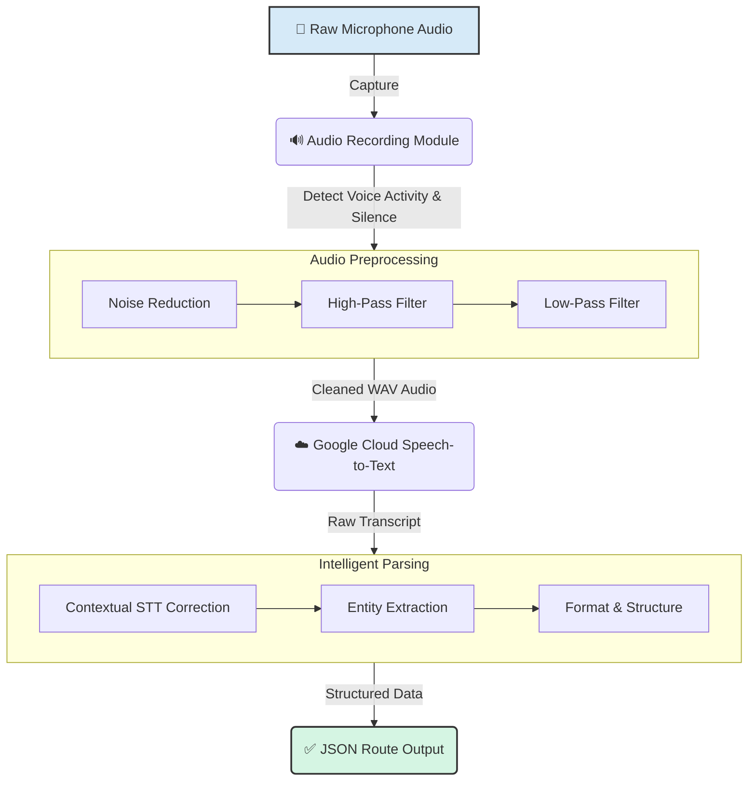

<!-- markdownlint-disable-next-line MD041 -->
<div align="center">
  <h1 align="center">Right Route App - AI Voice Module</h1>

  <p align="center">
    A professional-grade, AI-powered voice module for parsing US trucking routes from spoken instructions into structured, map-ready data.
  </p>

  <p align="center">
    <!-- Badges -->
    <a href="https://www.python.org/downloads/release/python-380/"></a>
    <a href="https://cloud.google.com/speech-to-text"></a>
    <a href="https://openai.com/api/"></a>
    <a href="./LICENSE"></a>
  </p>
</div>

---

The AI Voice Module for the Right Route App solves a critical logistics challenge: converting complex, spoken route permits from truck drivers into precise, structured data for mapping. The system listens to a driver's full route description, intelligently captures the start and end points, identifies all intermediate highways, and corrects common speech-to-text errors in real-time.

The final output is a clean JSON object, ready for integration with mapping APIs to plot the definitive route.

## Core Features

| Feature                  | Description                                                                                                                              |
| ------------------------ | ---------------------------------------------------------------------------------------------------------------------------------------- |
| **🎤 Voice-Activated Recording** | Uses voice activity detection (VAD) to record automatically. Filters background noise and auto-stops after a period of silence.        |
| **🔊 Advanced Audio Processing** | A multi-stage pipeline aggressively reduces noise and applies high-pass/low-pass filters to isolate human speech frequencies.         |
| **🗣️ High-Accuracy Transcription** | Leverages Google Cloud's enhanced `video` model, optimized for long-form, noisy audio and enriched with route-specific context hints. |
| **🧠 Intelligent Route Parsing** | Employs OpenAI's GPT-4o to perform contextual error correction and intelligently parse the raw transcript into a structured route. |
| **🗺️ Structured JSON Output** | Delivers clean, predictable JSON with `start_point`, `end_point`, and an ordered list of `route_segments`.                              |

## System Architecture

The module follows a sequential processing pipeline, transforming raw audio into structured route data. Each stage is optimized for accuracy and performance.



## Getting Started

### Prerequisites
*   Python 3.8 or higher
*   Microphone access for your system
*   **OpenAI API Key**: [Get your key](https://platform.openai.com/account/api-keys)
*   **Google Cloud Service Account**: [Create a service account](https://console.cloud.google.com/iam-admin/serviceaccounts) and download the JSON key file.

### Installation

1.  **Clone the Repository**
    ```bash
    git clone https://github.com/fahiiim/Right-Route-App-AI-Voice-Module-.git
    cd Right-Route-App-AI-Voice-Module-
    ```

2.  **Set Up a Virtual Environment**
    ```bash
    # Create the environment
    python -m venv venv

    # Activate it
    # On Windows:
    venv\Scripts\activate
    # On macOS/Linux:
    source venv/bin/activate
    ```

3.  **Install Dependencies**
    ```bash
    pip install -r requirements.txt
    ```

4.  **Configure Environment Variables**
    Create a `.env` file from the template and add your credentials.
    ```bash
    # Copy the example file
    cp .env.example .env

    # Open the file in your preferred editor
    nano .env
    ```
    Populate `.env` with your API keys:
    ```ini
    # .env
    OPENAI_API_KEY="sk-..."
    GOOGLE_APPLICATION_CREDENTIALS="/path/to/your/google-credentials.json"
    ```

## How to Use

Execute the main module from the command line. The system will prompt you to begin speaking.

```bash
python stt_module.py
```

### Example Session

```
[INFO] Awaiting user input...
[RECORDING] Listening... (Max 180s, auto-stops after 10s silence)
> User speaks the route instructions...
[SILENCE DETECTED] Recording stopped.
[INFO] Recording complete. Total duration: 25.4s

[PROCESSING] Applying audio filters...
[PROCESSING] Transcribing with Google Cloud STT...
[PROCESSING] Correcting and parsing route with OpenAI...
[INFO] Route extraction complete.

======================================================================
                        USA ROUTE INFORMATION
======================================================================

  ▶ START: START ON IA-9 EB AT A10 INTERSECTION (LYON) (STATE BORDER OF SOUTH DAKOTA)
  ▶ END:   END ON B62 WB AT QUAIL AVE INTERSECTION (HANCOCK) (IOWA)

  ▶ ROUTE:
      1. US-75 SB
      2. IA-9 EB
      3. US-59 SB
      4. US-18 EB
      5. IA-4 SB
      6. IA-3 EB
      7. US-69 NB
      8. B62 WB

======================================================================
```
The final JSON is saved to `route_output.json`.

## Configuration Details

The system is pre-configured for optimal performance but can be adjusted in `config.py` and `stt_module.py`.

| Parameter           | Value                       | Purpose                                        |
| ------------------- | --------------------------- | ---------------------------------------------- |
| **Recording**       |                             |                                                |
| `MAX_DURATION`      | 180s                        | Prevents excessively long recordings.          |
| `SILENCE_THRESHOLD` | 10s                         | Stops recording after 10 seconds of no speech. |
| `RMS_THRESHOLD`     | 500                         | Ignores low-volume background noise.           |
| **Audio Processing**|                             |                                                |
| `NOISE_REDUCTION`   | 95% `prop_decrease`         | Aggressively removes stationary background noise. |
| `HIGH_PASS_FILTER`  | 300 Hz                      | Eliminates low-frequency rumble (e.g., engine hum). |
| `LOW_PASS_FILTER`   | 7 kHz                       | Removes high-frequency hiss.                   |
| **AI Models**       |                             |                                                |
| `GOOGLE_STT_MODEL`  | `video` (enhanced)          | Best for long-form, potentially noisy audio.   |
| `OPENAI_MODEL`      | `gpt-4o`                    | State-of-the-art for reasoning and correction. |

## 🔐 API Key Security

> **Warning**
> Never commit API keys or credential files to your Git repository.

- **Environment Variables**: All keys are loaded securely from a `.env` file, which is listed in `.gitignore`.
- **Restricted Permissions**: When creating your Google Cloud service account, grant it only the `Cloud Speech-to-Text API User` role to follow the principle of least privilege.
- **Key Rotation**: If a key is accidentally exposed, revoke it immediately from your provider's dashboard and generate a new one.

## Troubleshooting

| Error Message                                     | Cause & Solution                                                                                                  |
| ------------------------------------------------- | ----------------------------------------------------------------------------------------------------------------- |
| `[ERROR] OPENAI_API_KEY environment variable not set` | Your key is missing. Ensure `OPENAI_API_KEY` is correctly set in your `.env` file.                                  |
| `[ERROR] No speech detected. Please try again.`     | The microphone did not pick up clear audio. Speak louder, move closer to the mic, or check your system audio settings. |
| `[ERROR] credentials must be of type...`            | Google Cloud authentication failed. Verify `GOOGLE_APPLICATION_CREDENTIALS` points to the correct JSON key file path. |
| `[ERROR] Route extraction failed...`                | The OpenAI API call failed. This is often due to an invalid API key or exceeding your usage/billing limits.         |

A simple API connection test script is included for diagnostics:
```bash
python test_api.py
```

## License

This project is proprietary and is protected by copyright law. Unauthorized reproduction, distribution, or modification of this software is strictly prohibited.

---
*Changelog: v1.0.0 (2025-12-12) - Initial stable release.*
